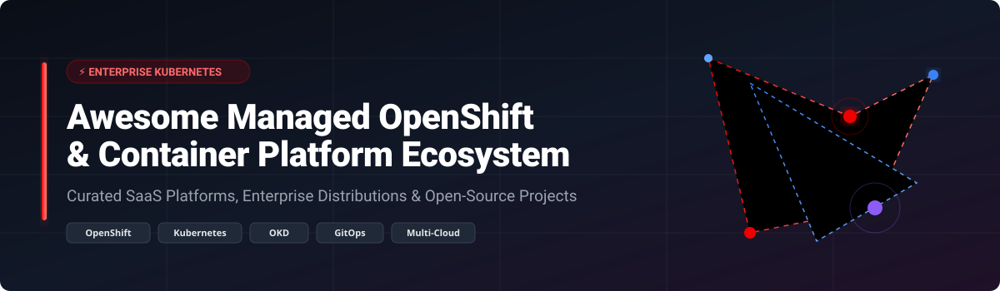

  

# 🚀 Awesome Managed OpenShift Platform Ecosystem ☸️

      

> A curated list of production-ready **Managed OpenShift SaaS Platforms**, **Enterprise Kubernetes Distributions**, and **Open-Source Container Orchestration Projects**. Empowering SREs, Platform Engineers, and Cloud-Native Architects to build scalable hybrid-cloud infrastructure.

---

## 📚 Table of Contents
- [🌐 Overview & Architecture](#-overview--architecture)
- [📊 Market Insights & Industry Overview](#-market-insights--industry-overview)
- [☁️ SaaS / Hosted Enterprise Platforms](#%EF%B8%8F-saas--hosted-enterprise-platforms)
- [🛠️ Open-Source GitHub Projects](#%EF%B8%8F-open-source-github-projects)
- [🤝 How to Contribute](#-how-to-contribute)
- [💖 Support & Buy Me a Coffee](#-support--buy-me-a-coffee)
- [⚖️ Disclaimer & License](#%EF%B8%8F-disclaimer--license)
- [📈 Star History](#-star-history)

---

## 🌐 Overview & Architecture

Modern enterprise container platforms combine **Kubernetes**, **OpenShift (OKD)**, and cloud-native GitOps tools to provide multi-cluster management, zero-trust security, and seamless developer workflows across public, private, and edge infrastructure.

Whether deploying managed solutions like **ROSA (AWS)**, **ARO (Azure)**, or hosting open-source **OKD** and **K3s**, this directory serves as an authoritative guide for selecting enterprise container technologies.

---

## 📊 Market Insights & Industry Overview

> 📊 **Market Insights**: The global Managed Kubernetes & Enterprise Container Platform market size is estimated at **$12.5 Billion (2026)** and projected to reach **~$32 Billion by 2030** expanding at a 24.5% CAGR. The market structure is **moderately concentrated** among top cloud hyperscalers (Microsoft Azure, AWS, Google Cloud, IBM/Red Hat), while retaining a **fragmented ecosystem** of specialized hybrid-cloud and open-source platform management providers competing for multi-cloud control plane dominance.

---

## ☁️ SaaS / Hosted Enterprise Platforms

The table below lists leading managed OpenShift services and enterprise Kubernetes SaaS offerings, sorted by **Company Size / Market Capitalization (Descending)**.

| 🏢 SaaS Platform & Vendor | 💰 Company Size / Valuation / Revenue | 💵 Starting Tier Pricing | 🎁 Free Tier / Free Trial Limits |
| :--- | :--- | :--- | :--- |
| **[Azure Red Hat OpenShift (ARO)](https://azure.microsoft.com/products/openshift/)**  Microsoft Corporation | ~$3.40 Trillion Market Cap  ($245B Annual Revenue) | **$0.171/hour** per worker node (~$125/month) + Azure VM infrastructure costs | **$200 free credit** valid for 30 days on Azure Free Account |
| **[Red Hat OpenShift Service on AWS (ROSA)](https://aws.amazon.com/rosa/)**  Amazon Web Services / AWS | ~$2.20 Trillion Market Cap  ($575B Annual Revenue) | **$0.171/hour** per 4-vCPU worker node (~$125/month) + AWS EC2/EBS rates | **$300 free AWS credits** for 60-day ROSA evaluation trial |
| **[Google Cloud Anthos / GKE Enterprise](https://cloud.google.com/anthos)**  Alphabet Inc. / Google | ~$2.00 Trillion Market Cap  ($307B Annual Revenue) | **$0.008/vCPU-hour** (~$24/vCPU/month) pay-as-you-go cluster management fee | **$300 free credit** for 90 days with GKE Enterprise evaluation |
| **[VMware Tanzu](https://tanzu.vmware.com/)**  Broadcom Inc. / VMware | ~$750 Billion Market Cap  ($50B Annual Revenue) | **$3,000 per CPU socket/year** (Tanzu Platform Enterprise starting rate) | **60-day free evaluation trial** with full enterprise feature access |
| **[Red Hat OpenShift Dedicated (ROSD)](https://www.redhat.com/en/technologies/cloud-computing/openshift/dedicated)**  Red Hat / IBM | ~$200 Billion Market Cap  ($62B Annual Revenue) | **$0.171/cluster-hour** (~$125/month) + cloud worker node compute rates | **60-day free hands-on cluster trial** (includes 4 worker nodes) |
| **[Red Hat OpenShift on IBM Cloud](https://www.ibm.com/cloud/openshift)**  IBM Corporation | ~$200 Billion Market Cap  ($62B Annual Revenue) | **$0.14 per vCPU/hour** (~$100/month per core) + IBM Cloud VPC infrastructure | **$200 free credit** for 30 days on IBM Cloud Pay-As-You-Go account |
| **[SUSE Rancher Prime](https://www.rancher.com/)**  SUSE Enterprise | ~$2.5 Billion Valuation  ($700M Annual Revenue) | **$1,000 per node/year** for enterprise SLA & commercial support | **100% Free Forever Community Edition** with unlimited cluster management |
| **[Canonical Charmed Kubernetes](https://ubuntu.com/kubernetes)**  Canonical Ltd. | ~$1.0 Billion Valuation  ($150M Annual Revenue) | **$500 per node/year** via Ubuntu Pro enterprise support tier | **Free Forever up to 5 nodes** via Ubuntu Pro personal subscription |
| **[Mirantis Kubernetes Engine (MKE)](https://www.mirantis.com/software/mirantis-kubernetes-engine/)**  Mirantis Inc. | ~$500 Million Valuation  ($100M Annual Revenue) | **$1,200 per node/year** (Mirantis MKE Standard tier) | **30-day free evaluation trial** supporting up to 5 nodes |

---

## 🛠️ Open-Source GitHub Projects

Below is a list of top open-source projects powering OpenShift, Kubernetes distributions, GitOps pipelines, and container engines, sorted by **GitHub Stars (Descending)**.

| 📦 Repository & Project | ⭐ GitHub Stars (Link to Stargazers) | 📝 Description |
| :--- | :---: | :--- |
| **[Kubernetes](https://github.com/kubernetes/kubernetes)** |  | The core open-source container orchestration platform underpinning OpenShift, Tanzu, and cloud services. |
| **[k3s](https://github.com/k3s-io/k3s)** |  | Lightweight CNCF-certified Kubernetes distribution built for IoT, Edge, Dev, and CI environments. |
| **[Podman](https://github.com/containers/podman)** |  | Rootless, daemonless container engine for developing, managing, and running OCI containers and pods. |
| **[Minikube](https://github.com/kubernetes/minikube)** |  | Local Kubernetes cluster runner designed for rapid developer onboarding and local testing. |
| **[Helm](https://github.com/helm/helm)** |  | The Kubernetes package manager for defining, installing, and upgrading complex cloud-native applications. |
| **[Rancher](https://github.com/rancher/rancher)** |  | Complete open-source multi-cluster management platform for running Kubernetes anywhere. |
| **[Cilium](https://github.com/cilium/cilium)** |  | eBPF-based networking, observability, and security enforcement framework for Kubernetes clusters. |
| **[Argo CD](https://github.com/argoproj/argo-cd)** |  | Declarative, GitOps continuous delivery tool for automated application deployment on Kubernetes. |
| **[KubeSphere](https://github.com/kubesphere/kubesphere)** |  | Open-source distributed operating system for managing multi-cloud Kubernetes clusters and workloads. |
| **[Crossplane](https://github.com/crossplane/crossplane)** |  | Framework to build custom cloud control planes and manage infrastructure using Kubernetes CRDs. |
| **[Linkerd2](https://github.com/linkerd/linkerd2)** |  | Ultra-light, security-first service mesh providing mTLS, metrics, and traffic management for Kubernetes. |
| **[OpenShift Origin](https://github.com/openshift/origin)** |  | Upstream core platform codebase powering Red Hat OpenShift and OKD container platforms. |
| **[Flux2](https://github.com/fluxcd/flux2)** |  | Open and flexible GitOps toolset for keeping Kubernetes clusters in sync with code repositories. |
| **[Operator SDK](https://github.com/operator-framework/operator-sdk)** |  | SDK for building Kubernetes native applications (Operators) using Go, Ansible, or Helm. |
| **[KubeVirt](https://github.com/kubevirt/kubevirt)** |  | Virtual machine management add-on for Kubernetes to run VMs side-by-side with containers. |
| **[k0s](https://github.com/k0sproject/k0s)** |  | Zero-friction, single-binary Kubernetes distribution with minimal dependencies and footprint. |
| **[Cluster API](https://github.com/kubernetes-sigs/cluster-api)** |  | Subproject delivering declarative APIs and tooling to simplify cluster lifecycle management. |
| **[Capsule](https://github.com/clastix/capsule)** |  | Multi-tenancy controller implementing tenant isolation and resource sharing in Kubernetes. |
| **[OKD Community Distribution](https://github.com/okd-project/okd)** |  | Official community distribution of Red Hat OpenShift optimized for continuous application delivery. |

---

## 🤝 How to Contribute

We welcome contributions from platform engineers, cloud architects, and open-source enthusiasts!

1. 🍴 **Fork** this repository.
2. 🌿 Create a feature branch (`git checkout -b add-new-platform`).
3. ✏️ Add or update entries in `README.md` following the tabular schema.
4. 📌 Ensure pricing, free tier limits, and GitHub star links are accurate and updated.
5. 🚀 Submit a **Pull Request** with a brief summary of additions.

---

## 💖 Support & Buy Me a Coffee

Thank you so much for exploring and using the **Awesome Managed OpenShift Platform** repository! 🚀

If you find this list helpful, please consider:
- ⭐ **Starring** this repository to help others discover it.
- 🍴 **Forking** and contributing new tools, SaaS solutions, or open-source projects.
- 📢 **Sharing** it with your fellow platform engineers, DevOps teams, and developers!

If you'd like to support my open-source work and buy me a coffee, you can sponsor me via the link below:

---

## ⚖️ Disclaimer & License

- ℹ️ **Disclaimer**: This repository is a community-curated collection intended for educational and reference purposes. Product names and logos belong to their respective owners.
- 📄 **License**: Released under the [MIT License](LICENSE).

---

## 📈 Star History

---

  <b>⭐ Star this repository if you find it helpful for your Kubernetes &amp; OpenShift journey! ⭐</b>

